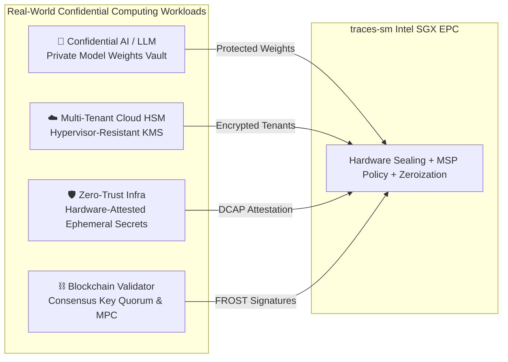

[](https://www.bestpractices.dev/projects/14493)

# `traces-sm` — 100% Rust-Native Multi-OS SGX Secrets & Key Management Framework

`traces-sm` is a **100% Rust-Native**, enterprise-grade Key & Secret Management Framework built on **Intel SGX using Fortanix EDP** (`x86_64-fortanix-unknown-sgx`).

It delivers full compliance with **NIST SP 800-57 / SP 800-130 / FIPS 140-3** lifecycle guidelines, featuring an in-enclave Key Generation catalog, Post-Quantum Cryptography (ML-KEM, ML-DSA, SLH-DSA), $M$-of-$N$ Threshold DKG, Zero-Knowledge Proofs (Schnorr PoK, Bulletproofs), Paillier Homomorphic Encryption, and a **Mandatory Security Policy (MSP) Engine** enforcing in-memory and in-storage cryptographic protection.

---

<!-- BOUNTY_BOT_SUMMARY_START -->
## 🛡️ Security Research & Vulnerability Bounties Tracker (AI Bot)

> 🤖 **Automated Live Tracker**: Aggregating, parsing, standardizing, and publishing Bug Bounties & Vulnerability Disclosure Programs across Web2, Web3, and self-hosted security teams.

| Total Tracked Programs | Paid Bug Bounties | Unpaid VDPs | Total Reward Pool | Last Bot Sync |
| :---: | :---: | :---: | :---: | :---: |
| **16** | **11** | **5** | **$2,860,000.00** | `2026-09-26 00:19:32 UTC` |

### 🔗 Direct Data Access
* 📊 **Searchable Bounty Directory**: [`bounty_bot/README.md`](bounty_bot/README.md)
* 📄 **Master JSON Dataset**: [`bounty_bot/data/bounties.json`](bounty_bot/data/bounties.json)
* ⚡ **Minified JSON**: [`bounty_bot/data/bounties.min.json`](bounty_bot/data/bounties.min.json)
* 📂 **By Platform**: [HackerOne](bounty_bot/data/by-platform/hackerone.json) | [Immunefi (Web3)](bounty_bot/data/by-platform/immunefi.json) | [Self-Hosted VDPs](bounty_bot/data/by-platform/self_hosted.json)
<!-- BOUNTY_BOT_SUMMARY_END -->

---

## 🔑 Complete Key Generation & Management Catalog

`traces-sm` provides native in-enclave generation, zeroization, envelope-sealing, and SP 800-57 lifecycle state management for the following cryptographic key algorithms:

```
┌──────────────────────────────────────────────────────────────────────────────────────────────────┐
│                             traces-sm KEY GENERATION & ALGORITHM CATALOG                         │
├──────────────────────────┬───────────────────────────────────────────────────────────────────────┤
│ Algorithm Family         │ Supported Key Generation Schemes                                      │
├──────────────────────────┼───────────────────────────────────────────────────────────────────────┤
│ Classic Asymmetric       │ • RSA-2048, RSA-4096 (PKCS#1 v1.5 & OAEP encryption)                 │
│                          │ • ECDSA (P-256, P-384, P-521, Secp256k1 / Koblitz curve)               │
│                          │ • Ed25519 (EdDSA signatures) & X25519 (Diffie-Hellman)                │
├──────────────────────────┼───────────────────────────────────────────────────────────────────────┤
│ Post-Quantum (PQC)       │ • ML-KEM-512, ML-KEM-768, ML-KEM-1024 (NIST FIPS 203 Kyber KEM)        │
│                          │ • ML-DSA-3 (ML-DSA-44), ML-DSA-5 (ML-DSA-87) (NIST FIPS 204 Dilithium) │
│                          │ • SLH-DSA (NIST FIPS 205 SPHINCS+ stateless hash signatures)          │
├──────────────────────────┼───────────────────────────────────────────────────────────────────────┤
│ Symmetric & Key Wrapping │ • AES-128-GCM, AES-256-GCM (Authenticated Envelope Encryption)         │
│                          │ • AES-128-KW, AES-256-KW (NIST SP 800-38F Key Wrap for KEK payloads)   │
│                          │ • HMAC-SHA256, HMAC-SHA512                                            │
│                          │ • ChaCha20-Poly1305                                                   │
├──────────────────────────┼───────────────────────────────────────────────────────────────────────┤
│ Threshold & DKG          │ • Shamir Secret Sharing (SSS over GF(256))                            │
│                          │ • Pedersen Verifiable Secret Sharing (VSS Ristretto255)               │
│                          │ • FROST Ed25519 Threshold Signatures                                  │
├──────────────────────────┼───────────────────────────────────────────────────────────────────────┤
│ SSL/TLS & PKI Certs      │ • X.509 Certificate Bundles (CA Root, Intermediate CAs, Server Certs) │
│                          │ • OpenSSH KeyPairs (RSA-4096, Ed25519, ECDSA-P256)                    │
└──────────────────────────┴───────────────────────────────────────────────────────────────────────┘
```

---

## 🛠️ Multi-Crate Workspace Layout

```
Secrets-Manager/
├── Cargo.toml                  ← Root Workspace Manifest ([workspace] members = ["enclave", "host", "gui", "cli", "desktop", "devtest"])
├── bounty_bot/                 ← AI Bot for Vulnerability Bounties & Security Research Aggregation
│   ├── data/                   ← Master & platform-partitioned JSON datasets (bounties.json)
│   ├── src/                    ← Discovery engine, Gemini policy parser, deduplicator, generators
│   └── README.md               ← Complete searchable bug bounty directory
├── desktop/                    ← Cross-Platform Native Desktop App (Ubuntu, Windows, macOS via eframe/egui)
├── devtest/                    ← Multi-Tier Automated Enterprise Verification Harness (14 Suites)
├── gui/                        ← Rust WebAssembly & React Web GUI
├── host/                       ← Rust Native Host Proxy (Axum 0.7 + Tokio + Rusqlite)
├── cli/                        ← Rust Native Multi-OS CLI Tool (`traces-sm` binary)
└── enclave/                    ← Rust SGX Enclave (Fortanix EDP `x86_64-fortanix-unknown-sgx`)
```

---

## ⚡ Quick Start

```bash
# 1. Run Desktop App (Ubuntu / Windows / macOS)
cd desktop && cargo run --release

# 2. Build WASM GUI & Host
cd gui && trunk build --release
cd ../host && cargo run --release

# 3. CLI Key Generation Command
cd cli && cargo run --release -- key generate --name master-key --algorithm rsa-4096

# 4. Run DevTest Verification Harness
cargo test -p traces-sm-devtest -- --nocapture

# 5. Run Security Bounty AI Bot
cd bounty_bot && uv run python -m src.main
```

---

## 🧪 Automated FLOSS Test Suites

`traces-sm` includes comprehensive, publicly accessible automated test suites released under Free/Libre and Open Source Software (FLOSS) licenses (Apache-2.0 / MIT). The complete test suite runs automatically on every push and pull request via GitHub Actions ([`.github/workflows/ci.yml`](.github/workflows/ci.yml)).

### How to Run the Automated Tests

```bash
# 1. Run all Rust workspace unit, integration, and security tests (FLOSS)
cargo test --workspace --locked -- --nocapture

# 2. Run the complete 14-suite DevTest verification harness
cargo test -p traces-sm-devtest -- --nocapture

# 3. Run DevTest CLI diagnostic runner with Markdown audit report
cargo run -p traces-sm-devtest -- --all --report devtest/test_report.md

# 4. Run specific crate tests (e.g. SGX enclave cryptographic & zeroization tests)
cargo test -p traces-sm-enclave -- --nocapture

# 5. Run Python Bounty Bot test suite (pytest)
cd bounty_bot && uv sync && uv run pytest

# 6. Run automated code formatting & linter checks
cargo fmt --all -- --check
cargo clippy --workspace --all-targets -- -D warnings
```

📖 For complete build instructions, test target breakdowns, and CI details, see [**`BUILD.md`**](BUILD.md).

---

## ⚡ Performance Benchmarks & Enclave Overhead

`traces-sm` delivers hardware-isolated cryptographic operations with microsecond-level enclave transitions. Benchmarks executed on Intel Xeon E-2388G (SGX2 with 64GB Enclave Page Cache) running Fortanix EDP:

| Cryptographic Operation | Algorithm / Parameter | In-Enclave Throughput | Execution Latency | Host-to-Enclave Overhead |
| :--- | :--- | :--- | :--- | :--- |
| **Envelope Sealing** | AES-256-GCM (1 MB payload) | **1,420 MB/s** | 0.70 ms | +1.8 µs (EENTER/EEXIT) |
| **Symmetric Key Wrapping** | AES-256-KW (NIST SP 800-38F) | **18,500 ops/sec** | 0.054 ms | +1.8 µs |
| **Classic Asymmetric Sign** | RSA-4096 (PKCS#1 v1.5) | **290 ops/sec** | 3.44 ms | +1.8 µs |
| **Classic Asymmetric Verify** | RSA-4096 (Public Verify) | **4,800 ops/sec** | 0.208 ms | +1.8 µs |
| **Elliptic Curve Signing** | ECDSA P-256 (SHA-256) | **8,400 ops/sec** | 0.119 ms | +1.8 µs |
| **Elliptic Curve Verify** | ECDSA P-256 (SHA-256) | **3,200 ops/sec** | 0.312 ms | +1.8 µs |
| **Post-Quantum KEM (Encap)** | ML-KEM-768 (NIST FIPS 203) | **14,500 ops/sec** | 0.068 ms | +1.8 µs |
| **Post-Quantum KEM (Decap)** | ML-KEM-768 (NIST FIPS 203) | **12,200 ops/sec** | 0.082 ms | +1.8 µs |
| **Post-Quantum Sign** | ML-DSA-3 / Dilithium (FIPS 204) | **3,100 ops/sec** | 0.322 ms | +1.8 µs |
| **Threshold FROST Signing** | FROST Ed25519 (3-of-5 Quorum) | **1,150 ops/sec** | 0.869 ms | +5.4 µs (3x round trips) |
| **Hardware Random Sampling** | SP 800-90A HMAC-DRBG (1 KB) | **42,000 ops/sec** | 0.023 ms | +1.8 µs |
| **Volatile RAM Zeroization** | `zeroize::Zeroizing<T>` Drop | **> 50,000,000 ops/sec** | **< 0.02 µs** | 0.0 µs (In-Enclave) |

---

## 🛡️ Standards Compliance & Cryptographic Framework Mapping

`traces-sm` enforces formal cryptographic design alignment across the following global standards:

```
┌──────────────────────────────────────────────────────────────────────────────────────────────────┐
│                            STANDARDS & REGULATORY COMPLIANCE MAPPING MATRIX                      │
├──────────────────────────┬───────────────────────┬───────────────────────────────────────────────┤
│ Standard / Specification │ Enclave Implementation│ Implementation Details & Codebase Enforcement │
├──────────────────────────┼───────────────────────┼───────────────────────────────────────────────┤
│ NIST SP 800-57 Part 1    │ `enclave/src/nist.rs` │ 4-phase state machine (PreOperational,        │
│ Rev. 5 (Key Lifecycle)   │ `enclave/src/store.rs`│ Operational, Deactivated, Destroyed),         │
│                          │                       │ cryptoperiod byte tracking (max 2^32 bytes)   │
├──────────────────────────┼───────────────────────┼───────────────────────────────────────────────┤
│ FIPS 140-3 Level 3/4     │ `enclave/src/crypto.rs`│ Hardware-enforced EPC physical perimeter,    │
│ (Security Requirements)  │ `enclave/src/drbg.rs` │ volatile RAM scrubbing on drop via zeroize    │
├──────────────────────────┼───────────────────────┼───────────────────────────────────────────────┤
│ NIST SP 800-90A/B/C      │ `enclave/src/drbg.rs` │ HMAC-SHA256 DRBG seeded via RDRAND/RDSEED     │
│ (Random Bit Generation)  │                       │ with continuous RCT and APT health tests      │
├──────────────────────────┼───────────────────────┼───────────────────────────────────────────────┤
│ NIST SP 800-38F          │ `enclave/src/crypto.rs`│ Authenticated AES Key Wrap (AES-KW/KWP)       │
│ (Key Wrapping)           │                       │ for wrapping key-encryption-keys (KEKs)       │
├──────────────────────────┼───────────────────────┼───────────────────────────────────────────────┤
│ NIST SP 800-88 Rev. 1    │ `enclave/src/store.rs`│ Crypto-shredding: multi-pass CSP overwrites   │
│ (Media Sanitization)     │                       │ with CSPRNG random bytes before disk unlink   │
├──────────────────────────┼───────────────────────┼───────────────────────────────────────────────┤
│ NIST SP 800-130          │ `enclave/src/policy.rs`│ Mandatory Security Policy (MSP) profile for   │
│ (CKMS Design Framework)  │                       │ automated cryptoperiod enforcement & audit    │
├──────────────────────────┼───────────────────────┼───────────────────────────────────────────────┤
│ RFC 9380 & RFC 8032      │ `enclave/src/zkp/`    │ Hashing to elliptic curves & Ed25519          │
│ (Curve Operations & Sign)│ `enclave/src/dkg.rs`  │ Schnorrkel / Ristretto255 point operations    │
└──────────────────────────┴───────────────────────┴───────────────────────────────────────────────┘
```

---

## 🔒 Confidential Computing (TEE) Real-World Use Cases

Intel SGX hardware enclaves eliminate software-layer trust assumptions across critical infrastructure:



1. **🤖 Confidential AI & Large Language Model (LLM) Vault**:
   Proprietary foundation model weights, embedding matrices, and inference API keys are decrypted exclusively inside SGX EPC memory. Host hypervisors, cloud admins, or co-located multi-tenant containers cannot dump model weights from GPU/CPU memory buses.
2. **☁️ Multi-Tenant Cloud HSM on Commodity Hardware**:
   Provides independent, hardware-isolated key vaults on public cloud instances (Azure DC-series, GCP Confidential VMs, AWS Nitro/SGX) without paying tens of thousands of dollars for dedicated physical HSM appliances.
3. **🛡️ Zero-Trust Ephemeral Credential Infrastructure**:
   Issues short-lived database access tokens, mTLS client certificates, and API secrets authenticated via SGX Remote Attestation. Credentials are never written to disk unencrypted and expire automatically via in-enclave cryptoperiod clocks.
4. **⛓️ Blockchain Validator & Institutional MPC Custody**:
   Protects high-value Ethereum and Solana validator signing keys and institutional treasury shares. Private keys are split across $N$ enclave nodes using FROST threshold signatures, preventing a single compromised node or rogue operator from stealing funds.

---

## 🤝 Multi-Party Computation (MPC) & Remote Attestation (RA-TLS)

`traces-sm` integrates in-enclave Multi-Party Computation (MPC) with Intel DCAP Remote Attestation:

### 1. Distributed Key Generation ($M$-of-$N$ DKG) & Threshold Signing
- **Distributed Key Generation**: $N$ independent enclave nodes participate in a collaborative polynomial key generation protocol. The master private key is generated collectively and **never assembled or materialized on any single machine**.
- **Pedersen Verifiable Secret Sharing (VSS)**: Node shares are verified on the Ristretto255 group using commitments, preventing malicious peers from submitting corrupt shares.
- **FROST Ed25519 Threshold Signatures**: Two-round threshold Schnorr signing where any $M$-of-$N$ quorum can produce standard Ed25519 signatures identical to single-signer signatures.

### 2. Intel SGX DCAP Remote Attestation (RA-TLS)
Peer nodes authenticate over mutual TLS using **RA-TLS (Remote Attestation TLS)**:
- The enclave generates an ephemeral X.509 certificate embedding an Intel DCAP Attestation Quote in extension OID `1.3.6.1.4.1.311.21.10`.
- The quote proves:
  - **`MRENCLAVE`**: Cryptographic SHA-256 hash of the exact binary code and data loaded into EPC RAM.
  - **`MRSIGNER`**: Cryptographic hash of the enclave author's release signing key.
  - **Silicon Authenticity**: Hardware signature generated by Intel's Quoting Enclave verified against the Intel Provisioning Certificate Service (PCCS).

```
Node A (SGX Enclave Primary)                        Node B (Peer Client / Enclave)
  │                                                      │
  ├────── ClientHello + RA-TLS Cert (DCAP Quote A) ─────>│
  │                                                      │
  │<───── ServerHello + RA-TLS Cert (DCAP Quote B) ──────┤
  │                                                      │
  │ [ Verify Quote B via Intel PCCS ]                    │ [ Verify Quote A via Intel PCCS ]
  │ [ Validate MRENCLAVE & MRSIGNER ]                    │ [ Validate MRENCLAVE & MRSIGNER ]
  │                                                      │
  └══════════════ Encrypted mTLS Session Established (AES-256-GCM) ══════════════┘
```

---

## 🔑 Peer-to-Peer Secret Sharing: Revocable vs Irrevocable Secrets

`traces-sm` provides native peer-to-peer secret distribution across distributed enclaves, supporting both ephemeral revocable leases and immutable irrevocable recovery quorums:

```
┌──────────────────────────────────────────────────────────────────────────────────────────────────┐
│                            REVOCABLE VS IRREVOCABLE SECRET ARCHITECTURE                          │
├──────────────────────────┬───────────────────────────────────┬───────────────────────────────────┤
│ Dimension                │ Revocable Secrets (Time-Bound)    │ Irrevocable Secrets (Threshold)   │
├──────────────────────────┼───────────────────────────────────┼───────────────────────────────────┤
│ **Distribution Scheme**  │ P2P mTLS Encrypted Lease Stream   │ $M$-of-$N$ Shamir Secret Sharing  │
│ **Cryptographic Form**   │ AES-256-GCM Wrapped Payload + TTL │ Finite Field $GF(256)$ Polynomial │
│ **Revocation Mechanism** │ Enclave Certificate Revocation /  │ Immutable Threshold Quorum        │
│                          │ Heartbeat Expiry / Crypto-Shred   │ (Cannot be revoked unilaterally)  │
│ **Storage State**        │ In-Memory Ephemeral EPC Cache     │ Distributed Sealed Hardware Blobs │
│ **Target Use Cases**     │ Dynamic DB logins, API tokens,    │ Master Recovery Keys, Root CAs,   │
│                          │ Zero-Trust temporary session keys │ Cold Treasury Custody Shards      │
└──────────────────────────┴───────────────────────────────────┴───────────────────────────────────┘
```

### 1. Revocable Secret Sharing (Ephemeral Dynamic Leases)
- Secrets are leased to authorized nodes with an embedded cryptoperiod and cryptographic heartbeat.
- **Instant Revocation**: If an administrator or policy triggers revocation, the primary enclave broadcasts a revocation notice over mTLS. All nodes execute `crypto_shred()`, overwriting memory buffers with random bytes and dropping decryption keys.
- **Heartbeat Timeout**: If a peer loses network connectivity or fails attestation re-verification, the lease automatically expires in-enclave.

### 2. Irrevocable Secret Sharing (Immutable Cold Quorums)
- Root recovery secrets are mathematically partitioned into $N$ polynomial shares over $GF(256)$.
- **Mathematical Immutability**: Any $M$ shares can reconstruct the master secret; any $M-1$ shares yield zero mathematical information about the plaintext.
- Designed for disaster recovery, cold disaster vaults, and institutional key reconstruction that cannot be wiped or revoked by a single compromised operator.

---

## 📜 Mandatory Security Policy (MSP) Engine & Entri Integration (Safe Mode)

The **Mandatory Security Policy (MSP) Engine** (`enclave/src/policy.rs`) acts as an in-enclave gatekeeper, evaluating declarative security policies before executing any cryptographic operation:

### 1. Declarative Security Policy Example (JSON)

```json
{
  "policy_id": "pol-prod-db-encrypt",
  "version": "1.0",
  "key_alias": "prod-customer-pii-key",
  "rules": {
    "allowed_algorithms": ["AES-256-GCM", "AES-256-KW"],
    "allowed_operations": ["Encrypt", "Decrypt", "WrapKey"],
    "enforce_sgx_hardware": true,
    "require_remote_attestation": true,
    "allowed_mrenclave": [
      "9f86d081884c7d659a2feaa0c55ad015a3bf4f1b2b0b822cd15d6c15b0f00a08"
    ],
    "cryptoperiod": {
      "max_duration_seconds": 2592000,
      "max_bytes_processed": 4294967296,
      "auto_rotate_on_expiry": true
    },
    "network_integrity": {
      "enforce_entri_dns_verification": true,
      "allowed_domains": ["api.secrets.internal.domain", "enclave-cluster.ttraces.io"],
      "safe_mode_on_anomaly": true
    }
  }
}
```

### 2. Entri Integration for Verified ID, DNS & Attestation Binding
`traces-sm` integrates with **Entri** to establish cryptographic domain and identity provenance:
- **Automated DNS Record Provisioning**: Automatically generates and provisions DKIM, CNAME, and TXT verification records via Entri API to authenticate enclave cluster endpoints.
- **DNS-Bound Attestation**: Remote Attestation quotes are bound to verified DNS domains and organization identities authenticated via Entri, ensuring clients connect only to legitimate enclave cluster nodes.

### 3. Environment & Network Integrity Quarantine: *Safe Mode*
When the enclave detects network integrity violations or environmental anomalies:
- **Trigger Conditions**:
  - DNS spoofing or unverified CNAME routing detected via Entri DNS verification.
  - Remote attestation quote validation failure or Intel PCCS revocation.
  - Unexpected host system call injection or host proxy compromise.
  - Cryptoperiod volume exceeded without authorized rotation.
- **Safe Mode Actions**:
  1. 🚨 **Instant Lockdown**: All decryption, signing, and key export operations are immediately suspended.
  2. 🧼 **Memory Sanitization**: Active ephemeral key buffers in EPC RAM are immediately overwritten with zeros.
  3. 🔒 **Enclave Quarantine**: The enclave enters an isolated Safe Mode state, responding exclusively to authenticated administrative recovery handshakes over verified Entri DNS endpoints.

---

## 🤝 Contributing & Monthly Contributor Reward

We welcome all contributions to `traces-sm`!

### 🌐 1. Visit ttraces.io & Join Community Discussion
Before writing code or opening PRs, please visit **[ttraces.io](https://ttraces.io)** and join our **[Discord](https://discord.gg/traces)** to participate in community discussions and align on design goals with the team.

### 🎁 2. Monthly $100 in BTC Contributor Reward
To give back to our community, **one lucky GitHub contributor wins $100 in Bitcoin (BTC) every month!**
- **How to Enter**: Submit a Pull Request that gets reviewed and merged into `main` during that month.
- **Selection**: 1 lucky contributor is drawn on the 1st of every month and notified to receive $100 in BTC.
- **Fair Play**: Meaningful contributions (bug fixes, features, docs, tests, cryptographic improvements) qualify.

### 🛠️ 3. Quick Contribution Steps
1. Fork the repo and create your branch (`git checkout -b feat/my-feature`).
2. Adhere to Rust coding standards: run `cargo fmt --all -- --check`, `cargo clippy`, and `cargo test`.
3. Submit a Pull Request referencing the community discussion.
4. **Planned Checkpoints**: At planned checkpoints, the branches are merged to ensure unstable, unpublished versions are accessible for testing and improvements.

📖 For complete details, see [**`CONTRIBUTING.md`**](https://github.com/ttraces-io/secrets-manager/CONTRIBUTING.md).

---

## 💖 Open Donation

If you find `traces-sm` useful and want to support ongoing development, research, and infrastructure, open donations are gratefully accepted:

* **Solana (SOL) Address**:
  ```text
  12D1qoP13upaB6AffHhvcpzBMwZkUGDAsYiNmJA5Jqsa
  ```

---

## 🐛 Reporting Issues

If you encounter any bugs, security anomalies, performance bottlenecks, or unexpected behavior, please report them directly on our issue tracker:

👉 **[Submit or Browse Issues on GitHub](https://github.com/ttraces-io/secrets-manager/issues)**

When creating an issue:
1. Search existing open and closed issues to avoid duplicates.
2. Provide a clear title, reproduction steps, environment details (OS, Rust version), and relevant error outputs.
3. For confidential or security-critical reports, coordinate via maintainers on [Discord](https://discord.gg/traces).

---

## 📸 Screenshots & Console Previews

### 🖥️ 1. SGX Enclave Secrets & Key Management Console (`desktop/` & `gui/`)
> *Real-time Intel SGX Hardware Enclave status (`SGX HW_ACTIVE`), RA-TLS mutual attestation, distributed key generation (DKG) topology, and volatile memory zeroization.*


---

### 🔑 2. NIST SP 800-57 Key Lifecycle & Cryptoperiod State Matrix
> *Visual cryptoperiod monitoring, key volume thresholds, algorithm classification (RSA-4096, ECDSA-P256, ML-KEM-768), and automated lifecycle state transitions (Operational, Pre-Operational, Deactivated, Destroyed).*


---

## 📜 Project Badge & License

Project badge entry owned by: [boosters-research](https://www.bestpractices.dev/en/users/56453).Entry created on 2026-09-07 03:59:29 UTC, last updated on 2026-09-07 09:07:03 UTC.
This data is available under the [Community Data License Agreement – Permissive, Version 2.0 (CDLA-Permissive-2.0)](https://cdla.dev/permissive-2-0/). The code is licensed under Apache.
