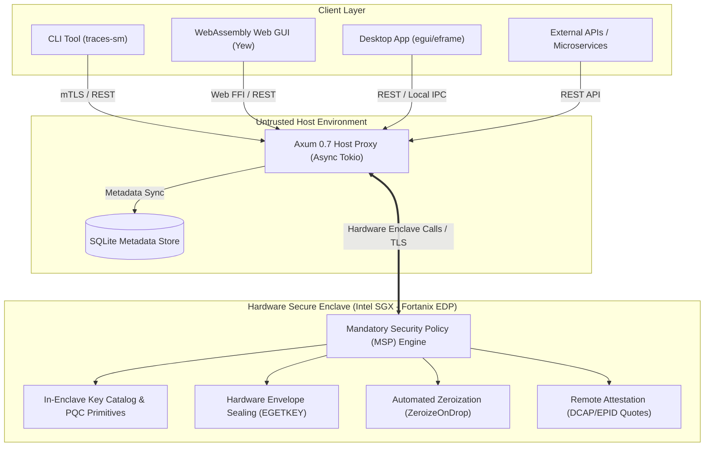

# 🏛️ Executive Summary: `traces-sm`

## 1. Vision & Executive Overview

Modern cloud infrastructure and microservices architectures suffer from a fundamental vulnerability: **traditional secrets managers execute in untrusted host memory**. Whether running on on-premise hypervisors or public cloud instances (AWS, GCP, Azure), root administrators, kernel exploits, hypervisor bugs, and insider threats can snoop plaintexts, dump cryptographic keys, or tamper with runtime state.

**`traces-sm`** is a **100% Rust-Native, Multi-OS Confidential Secrets & Key Management Framework** built on **Intel SGX using the Fortanix Enclave Development Platform (EDP)** (`x86_64-fortanix-unknown-sgx`). It delivers hardware-enforced cryptographic isolation where keys, secrets, and zero-knowledge computations execute exclusively inside encrypted enclave page caches (EPC), completely hidden from the host operating system, hypervisors, and physical memory probes.

---

## 2. Core Value Propositions

```
┌──────────────────────────────────────────────────────────────────────────────────────────────────┐
│                                   traces-sm STRATEGIC PILLARS                                    │
├──────────────────────────┬───────────────────────────────────────────────────────────────────────┤
│ 🛡️ Hardware Confidentiality │ Hardware-enforced isolation via Intel SGX Enclaves (Fortanix EDP)    │
│ 📜 Standards Compliant   │ Full NIST SP 800-57, SP 800-130 & FIPS 140-3 lifecycle guarantees   │
│ ⚛️ Quantum-Resistant     │ Native Post-Quantum Cryptography (ML-KEM, ML-DSA, SLH-DSA)            │
│ 🤝 Distributed Custody    │ In-enclave Threshold DKG, Shamir Secret Sharing, and FROST Signatures │
│ 🌐 Multi-OS & Universal  │ Native CLI, WebAssembly Web GUI, and Cross-Platform Desktop (egui)    │
│ 🦀 100% Rust Security    │ Memory safety, explicit zeroization, and zero unverified unsafe code   │
└──────────────────────────┴───────────────────────────────────────────────────────────────────────┘
```

### Key Highlights

1. **Hardware-Enforced Confidential Computing**:
   Cryptographic key generation, signing, envelope wrapping, and unsealing occur inside a cryptographically verified Intel SGX Enclave. Even with full root or ring-0 access, the host cannot extract plaintext key bytes.

2. **NIST SP 800-57 & FIPS 140-3 Compliance**:
   Rigid enforcement of key states (Pre-Activation, Active, Suspended, Deactivated, Compromised, Destroyed) paired with Mandatory Security Policy (MSP) rules preventing unauthorized transitions or key reuse.

3. **Built for the Quantum Era (PQC Ready)**:
   Pre-integrated with the latest NIST Post-Quantum standards:
   - **ML-KEM** (FIPS 203 / Kyber) for key encapsulation.
   - **ML-DSA** (FIPS 204 / Dilithium) for digital signatures.
   - **SLH-DSA** (FIPS 205 / SPHINCS+) for stateless hash-based signatures.

4. **Multi-Party Threshold & Zero-Knowledge Cryptography**:
   Built-in support for $M$-of-$N$ Shamir Secret Sharing, Pedersen Verifiable Secret Sharing (VSS over Ristretto255), FROST Ed25519 threshold signatures, Schnorr Proofs of Knowledge, Bulletproof range proofs, and Paillier Homomorphic Encryption.

5. **Universal Multi-Platform Accessibility**:
   A single cohesive workspace delivering:
   - **Enclave (`enclave/`)**: Fortanix EDP SGX core.
   - **Host Proxy (`host/`)**: High-performance Axum 0.7 REST API with SQLite WAL metadata persistence.
   - **CLI (`cli/`)**: Scriptable multi-OS command-line interface.
   - **Web GUI (`gui/`)**: Client-side Rust WebAssembly (Yew 0.21) app.
   - **Desktop App (`desktop/`)**: Cross-platform native GUI for Linux, Windows, and macOS via `egui`/`eframe`.

---

## 3. High-Level System Architecture



---

## 4. Strategic Impact & Roadmap

`traces-sm` bridges the gap between complex hardware security modules (HSMs costing tens of thousands of dollars) and software-only secrets managers. By leveraging commodity Intel SGX CPUs and cloud confidential computing nodes (Azure DC-series, GCP Confidential VMs, AWS Nitro/SGX), organizations achieve military-grade secret protection at standard cloud operational costs.

* **Ecosystem Hub**: [https://ttraces.io](https://ttraces.io)
* **Open Source Repository**: [https://github.com/ttraces-io/secrets-manager](https://github.com/ttraces-io/secrets-manager)
* **Community & Governance**: Fully open-source under dual Apache-2.0 / MIT licensing with monthly contributor rewards.
